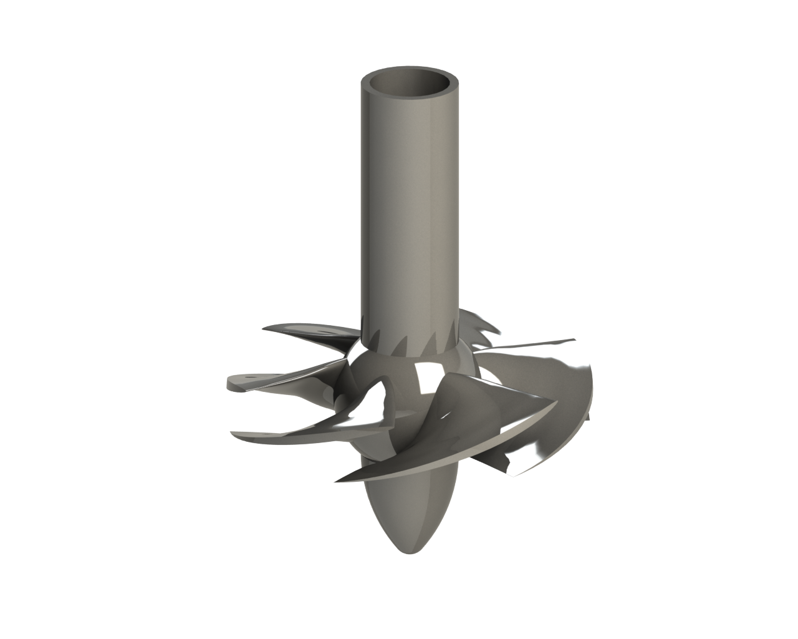
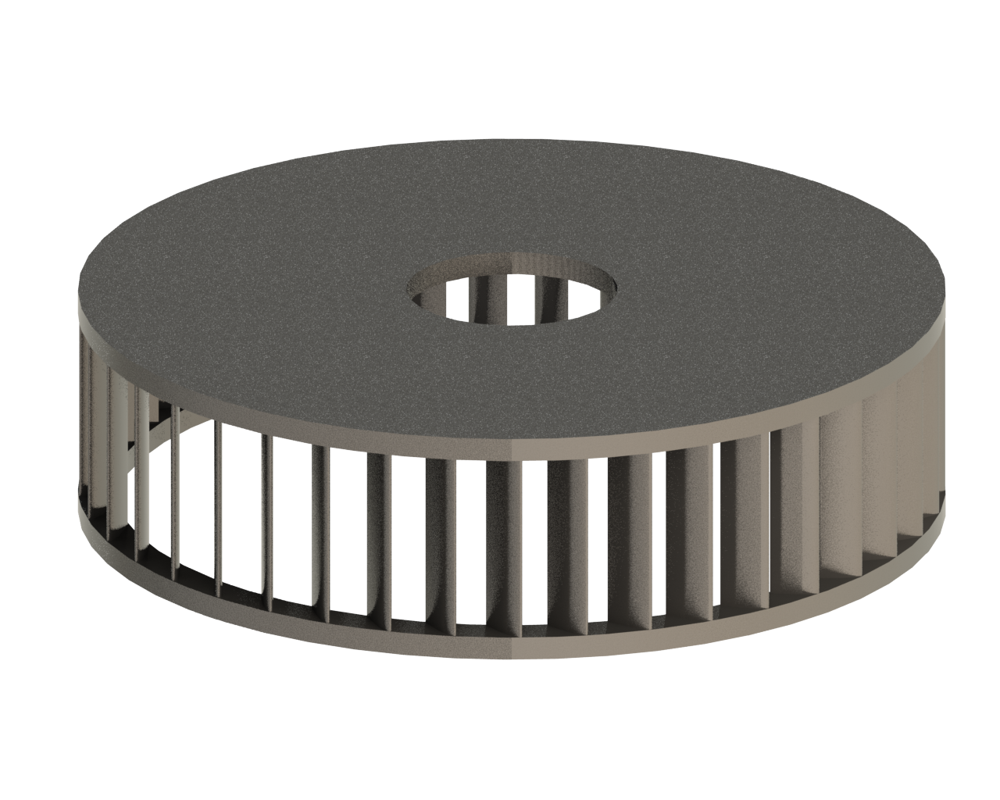
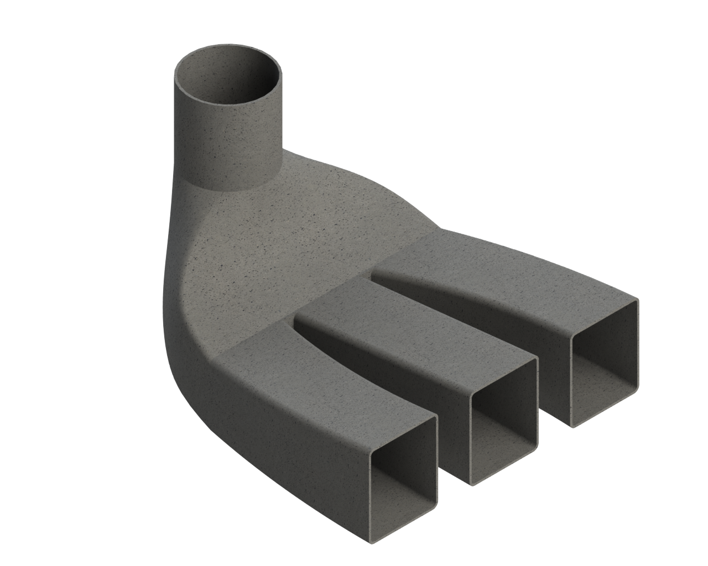
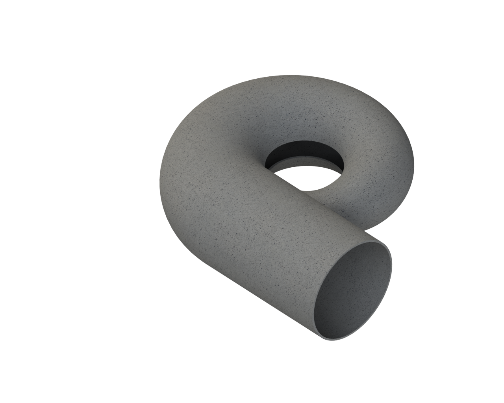

# Kaplan Turbine Design

## Project Description

This project involves the design and analysis of a Kaplan-type turbine, which includes the sizing and analysis of the necessary parameters for the design of the runner, distributor, draft tube, and spiral casing. A CAD design has been created, and CFD simulations have been carried out to verify the performance of the design.

## Technologies Used

- **3D Modeling**: SolidWorks
- **Technical Documentation**: AutoCAD

## Repository Contents

- `/cad_models`: Contains CAD files in .stl, .step, .iges formats.
- `/documentation`: Technical drawings and project documentation in PDF format.

## Installation and Usage

To view and modify the CAD models:

1. Clone the repository: `git clone https://github.com/sergio-moldes/turbina-kaplan.git`
2. Open the files in SolidWorks or your preferred software.

## Contributions

Contributions are welcome. Please open an issue or submit a pull request to discuss any changes you wish to make.

## License

This project is licensed under the MIT License - see the [LICENSE](LICENSE) file for details.

## Project Documentation

The project has been thoroughly documented in the following PDF file: [Kaplan Turbine Design Documentation](documentation/Memoria_turbina_kaplan_final.pdf)

### Documentation Summary

#### 1. Introduction

Describes the project objective and provides an overview of the Kaplan turbine design.

#### 2. Nomenclature and Symbols

List of symbols and nomenclature used in the design calculations.

#### 3. Runner Calculations

Detailed calculations for the sizing of the runner, including initial parameters, outer diameter, free passage section, and hydraulic performance.

#### 4. Distributor Design

Calculations and design of the distributor blades, incidence angle, and blade height.

#### 5. Draft Tube Calculations

Cavitation analysis and suction height, sizing of the draft tube.

#### 6. Spiral Casing Design

Sizing and design of the spiral casing that directs the flow to the runner.

#### 7. CAD Design

CAD design process of the runner, distributor, draft tube, and spiral casing, including chord and angle correction.

### Project Images

Here are some images of the final CAD design:

