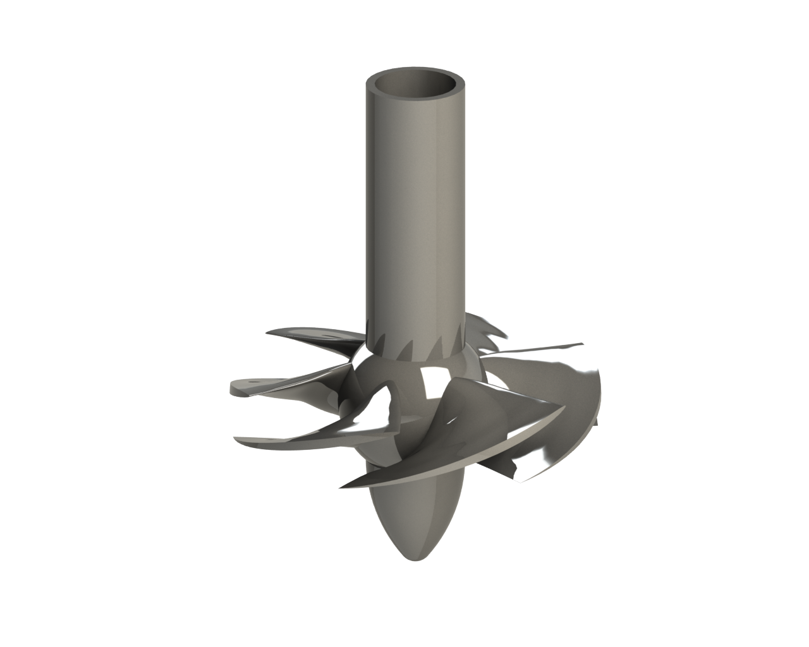
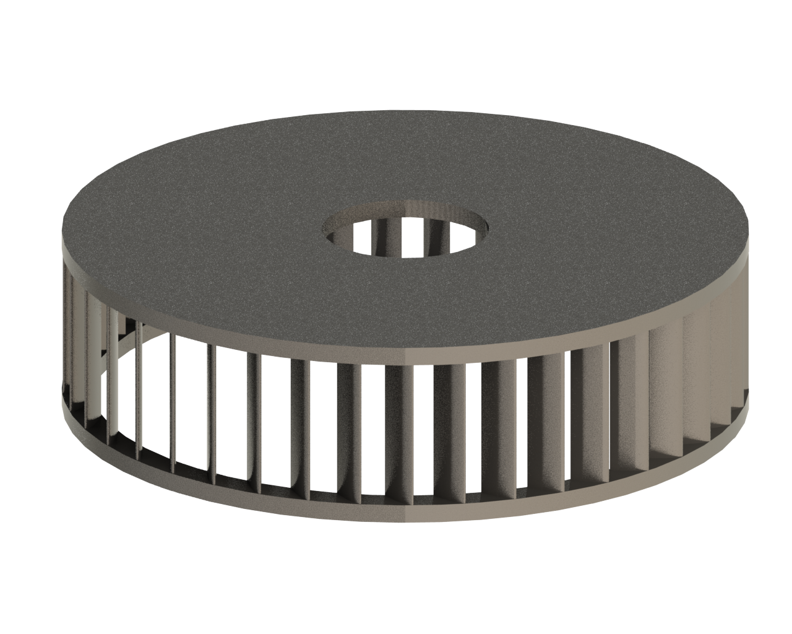
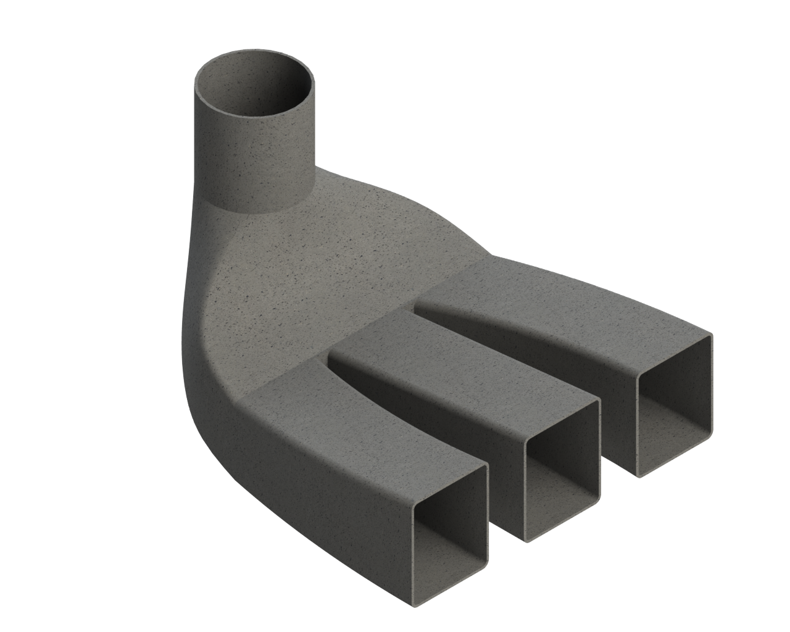
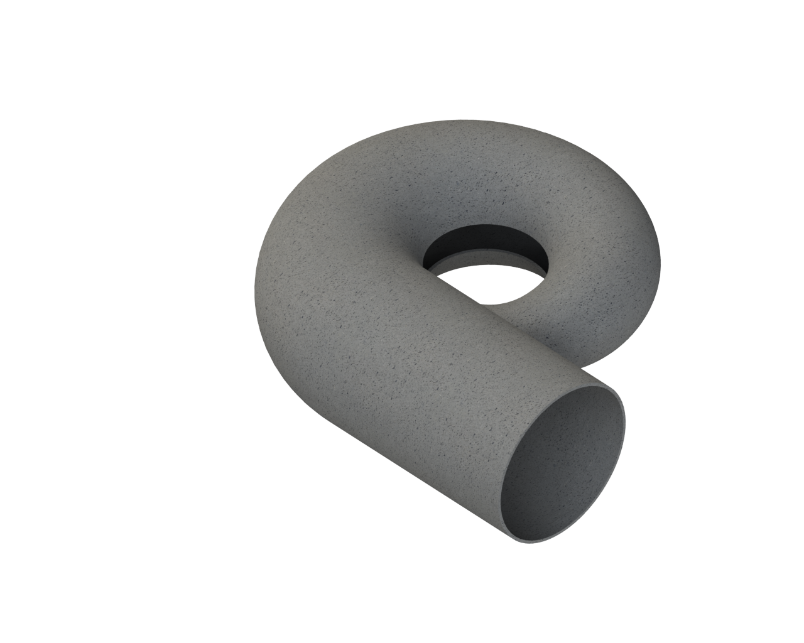

# Diseño de Turbina Kaplan

## Descripción del Proyecto

Este proyecto involucra el diseño y análisis de una turbina tipo Kaplan, que incluye el dimensionamiento y análisis de los parámetros necesarios para el diseño del rodete, distribuidor, tubo de aspiración y caja espiral. Se ha realizado un diseño en CAD y se han llevado a cabo simulaciones CFD para verificar el rendimiento del diseño.

## Tecnologías Utilizadas

- **Modelado 3D**: SolidWorks
- **Análisis CFD**: ANSYS Fluent
- **Simulación y Meshing**: Hypermesh
- **Documentación Técnica**: AutoCAD

## Contenidos del Repositorio

- `/modelos_cad`: Contiene los archivos CAD en formatos .stl, .step, .iges.
- `/analisis_cfd`: Resultados y scripts de análisis CFD realizados en ANSYS Fluent.
- `/documentacion`: Planos técnicos y documentación del proyecto en formato PDF.

## Instalación y Uso

Para visualizar y modificar los modelos CAD:

1. Clonar el repositorio: `git clone https://github.com/sergio-moldes/turbina-kaplan.git`
2. Abrir los archivos en SolidWorks o el software de tu elección.

## Contribuciones

Las contribuciones son bienvenidas. Por favor, abre un issue o envía un pull request para discutir cualquier cambio que desees realizar.

## Licencia

Este proyecto está licenciado bajo la Licencia MIT - ver el archivo [LICENSE](LICENSE) para más detalles.

## Documentación del Proyecto

El proyecto se ha documentado exhaustivamente en el siguiente archivo PDF: [Memoria de Diseño de Turbina Kaplan](documentacion/Memoria_turbina_kaplan_final.pdf)

### Resumen de la Memoria

#### 1. Introducción

Se describe el objetivo del proyecto y una visión general del diseño de la turbina Kaplan.

#### 2. Nomenclatura y Simbología

Lista de símbolos y nomenclatura utilizados en los cálculos del diseño.

#### 3. Cálculos del Rodete

Cálculos detallados para el dimensionado del rodete, incluyendo parámetros iniciales, diámetro exterior, sección libre de paso y rendimiento hidráulico.

#### 4. Diseño del Distribuidor

Cálculos y diseño de los álabes del distribuidor, ángulo de incidencia y altura de los álabes.

#### 5. Cálculos del Tubo de Aspiración

Análisis de cavitación y altura de succión, dimensionado del tubo de aspiración.

#### 6. Diseño de la Caja en Espiral

Dimensionado y diseño de la caja espiral que dirige el flujo hacia el rodete.

#### 7. Diseño en CAD

Proceso de diseño en CAD del rodete, distribuidor, tubo de aspiración y caja espiral, incluyendo la corrección de cuerda y ángulos.

### Imágenes del Proyecto

Aquí se incluyen algunas imágenes del diseño final en CAD:

